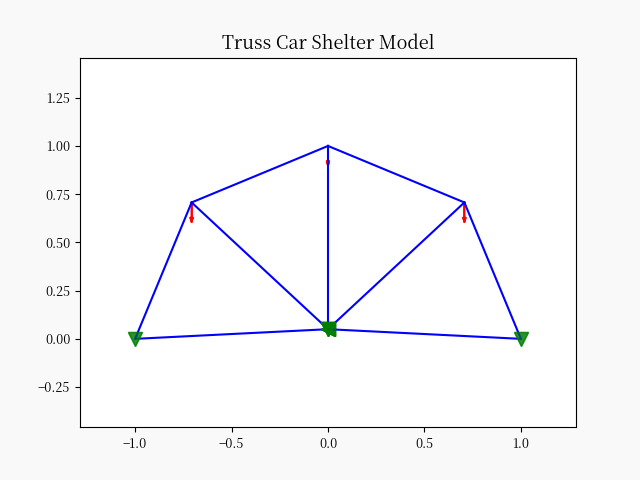

# bborb

## Portable Car Shelter Design 

Vehicle shelter is important to many peoples’ personal quality of life.
The proposed solution is a portable car shelter capable of protecting cars in conditions ranging from rain to snow and
more extreme conditions.
A survey is proposed and data is collected regarding the most desirable traits of such a solution, providing a clear
picture of the most important traits for the customer base.
Some important characteristics explored in the survey include price, portability, strength, and size.
Existing solutions are studied to provide information concerning existing methods.
This data is gathered through the searching of both product listings and existing patents.
The relationship and significance of customer needs and design features is explored in a QFD analysis and correlation
matrix.
Material selection and its impact on design and manufacturing is considered.
A design specification is produced as a result of these consideration, and a schedule for the resulting project is
proposed.

## Analysis Tool

This tool will provide design verification and analysis for component sizing and safety benchmarking.

The main structural elements are a tubing truss, tarp cover, and rotating pin connection.
All of these structural elements are prone to failure and therefore accurate modelling is essential.

A truss model for the tubing and tarp elements is shown below. This model is meant to respond to a range of loading
cases.

A model of the pin structural response is coupled to the tubing forces. This will ensure that the pin component will not
fail under loading.

